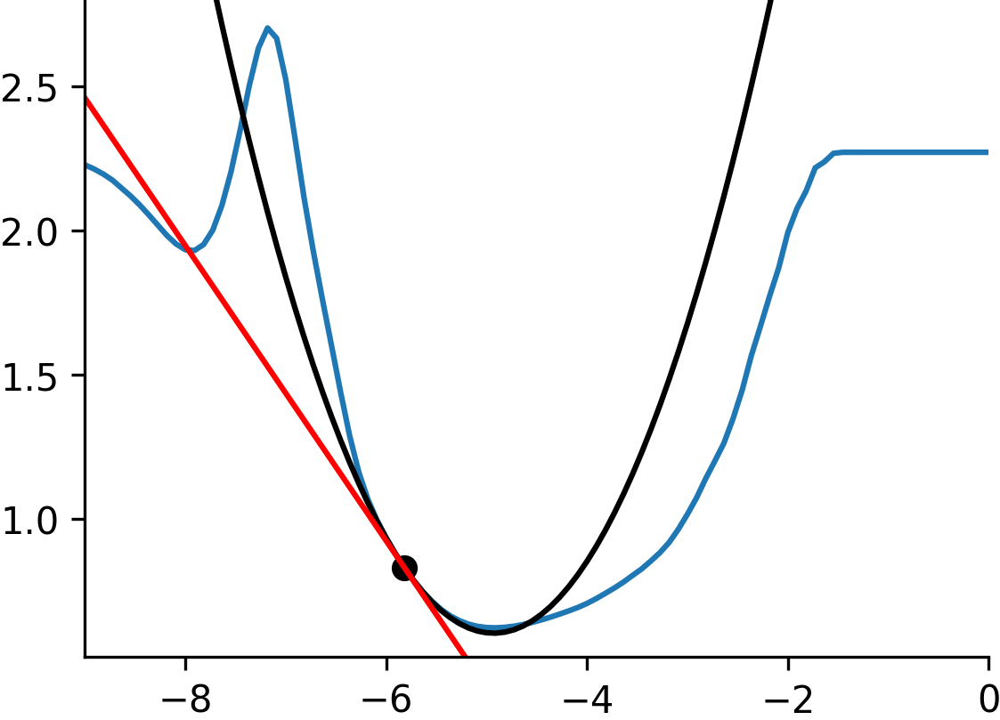

# Optimization Sensitivity in JAX - Reference Documentation - First- and Second-order Optimization

``sensitivity_jax`` is a package designed to allow taking first- and
**second-order** derivatives through optimization or any other fixed-point
process.

Source code for this package is located [here:
github.com/rdyro/sensitivity_jax](https://github.com/rdyro/sensitivity_jax>).

This package builds on top of [JAX](https://github.com/google/jax). We also
maintain an implementation in [PyTorch](https://pytorch.org/)
[here](https://rdyro.github.io/sensitivity_torch/).

    

